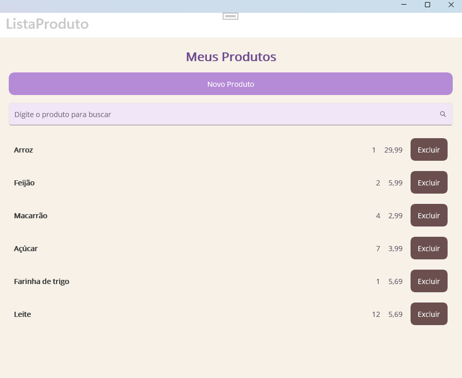
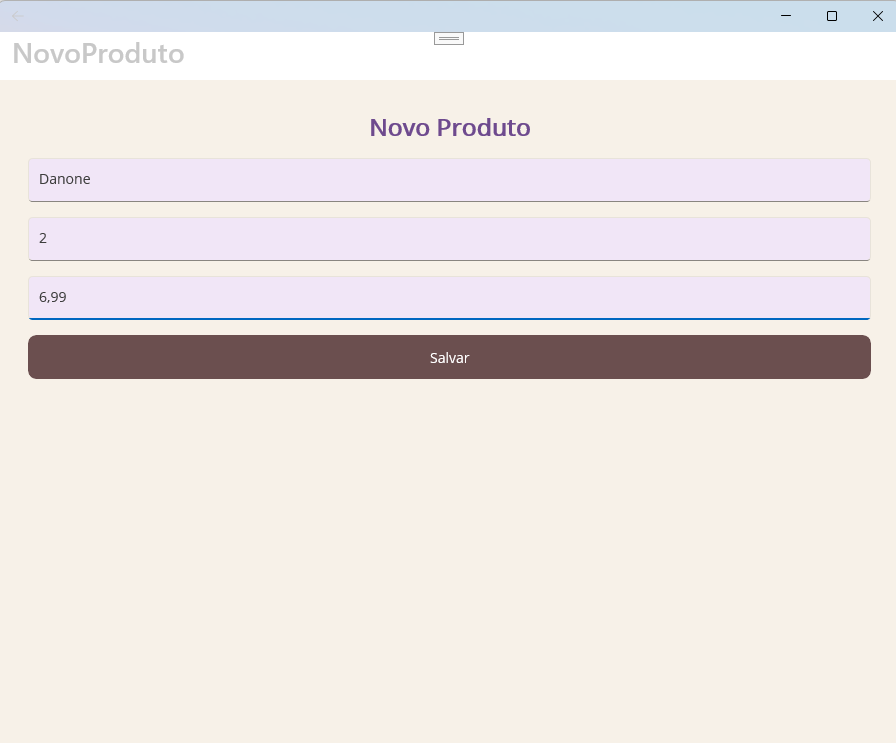
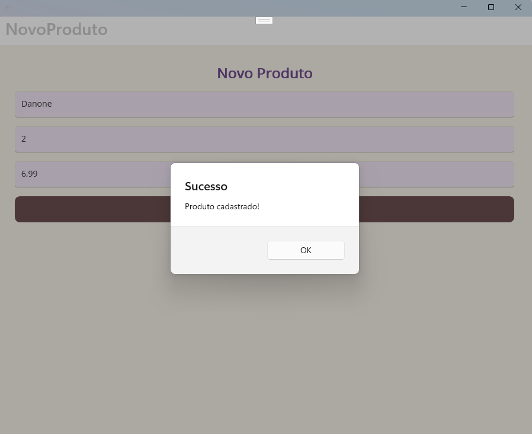
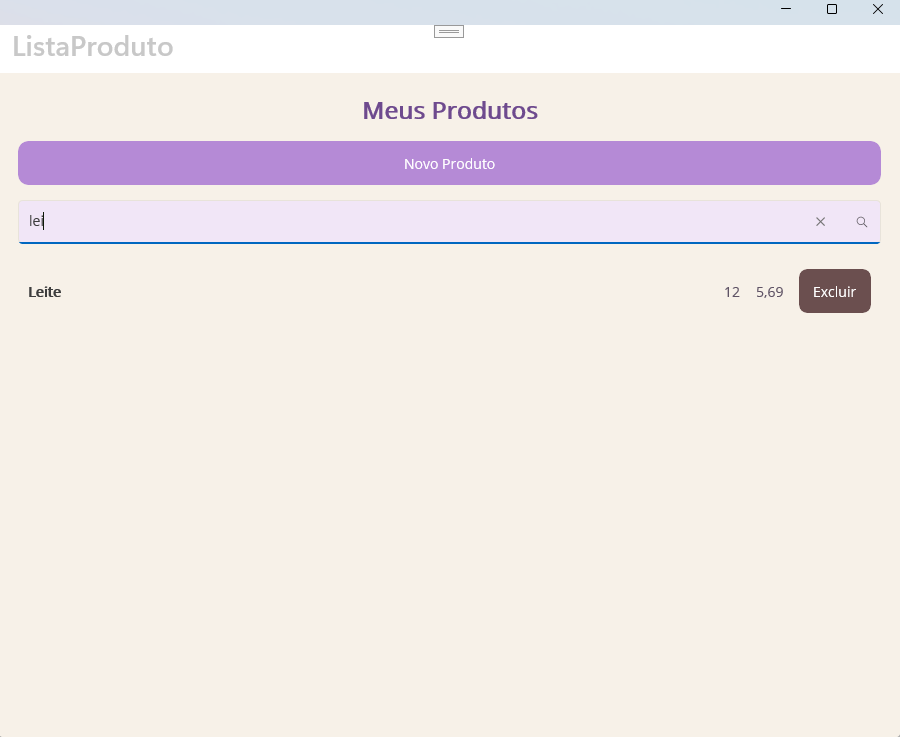
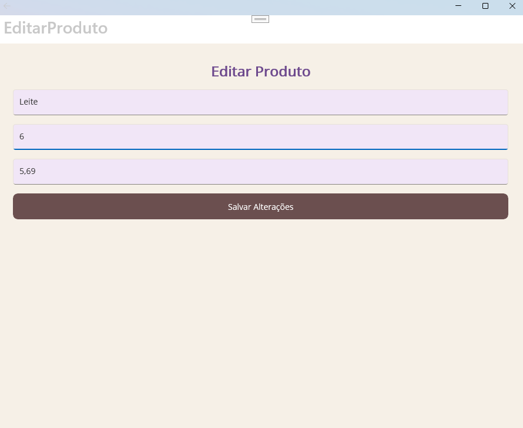
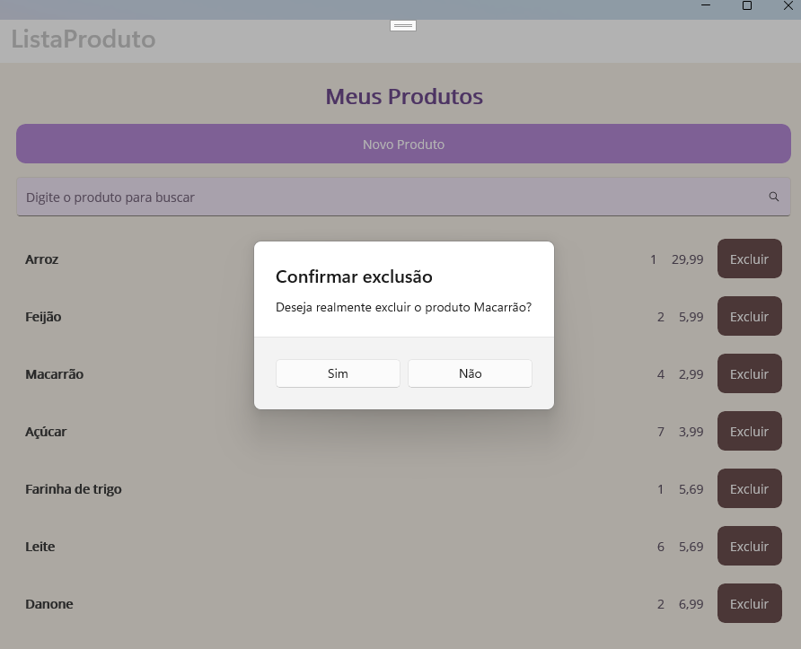
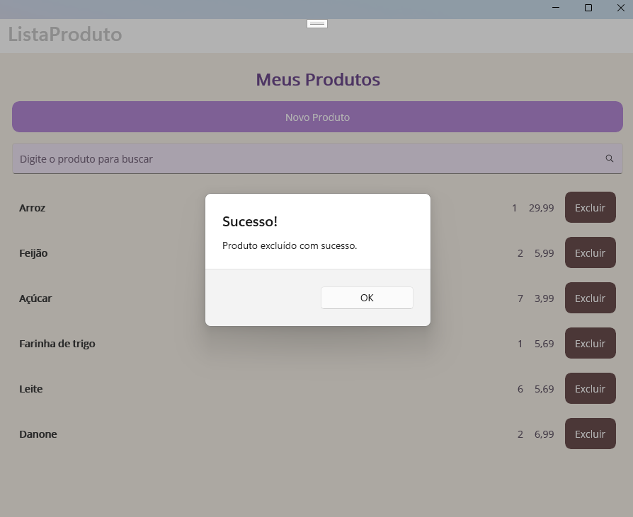
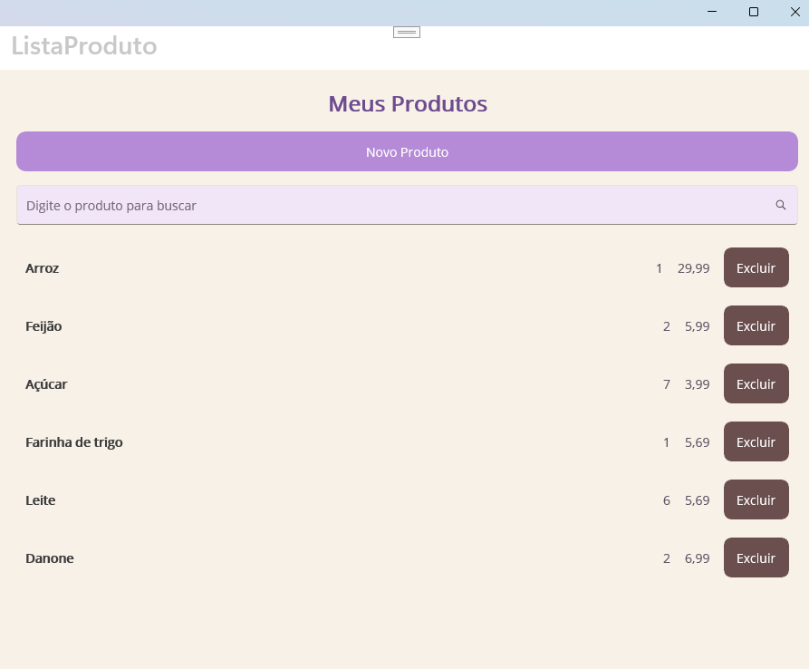

# MauiAppMinhasCompras

Aplicativo desenvolvido em .NET MAUI utilizando C#, XAML e banco de dados SQLite.

O projeto está sendo desenvolvido ao longo das atividades da disciplina de Desenvolvimento de Sistemas III, do Módulo 3 do curso de Desenvolvimento de Sistemas, com o objetivo de colocar em prática os conteúdos estudados durante a disciplina.

## Sobre o projeto

O MauiAppMinhasCompras é um aplicativo para cadastro e gerenciamento de produtos.

Por meio do aplicativo, é possível cadastrar produtos, visualizar os itens armazenados, realizar pesquisas, editar informações e excluir produtos. Os dados são armazenados localmente utilizando SQLite.

## Funcionalidades

O aplicativo permite:

- Cadastrar novos produtos, informando descrição, quantidade e preço;
- Validar as informações preenchidas antes do cadastro;
- Armazenar os dados utilizando SQLite;
- Visualizar os produtos cadastrados em uma lista;
- Pesquisar produtos pelo nome utilizando busca dinâmica;
- Selecionar um produto já cadastrado;
- Editar descrição, quantidade e preço;
- Salvar as alterações e atualizar os dados armazenados;
- Excluir produtos cadastrados;
- Solicitar confirmação antes da exclusão;
- Exibir mensagens de sucesso após determinadas operações;
- Tratar erros e exceções durante operações do aplicativo;
- Manter os produtos armazenados mesmo após fechar e abrir novamente o aplicativo.

## Evolução do projeto

### Agenda 02

Na Agenda 02 foram desenvolvidas as principais funcionalidades do aplicativo.

Foram criadas as telas de listagem, cadastro e edição de produtos.

Também foi implementada a comunicação com o banco de dados SQLite, permitindo cadastrar, listar e atualizar os produtos.

Ao selecionar um item na tela de listagem, o aplicativo abre a tela **Editar Produto**, permitindo alterar a descrição, a quantidade e o preço. Após salvar, os dados são atualizados no banco SQLite e exibidos novamente na listagem.

### Agenda 03

Na Agenda 03 foi realizada uma atualização na forma como o aplicativo acessa o banco de dados SQLite.

No arquivo `App.xaml.cs`, foi criado um acesso centralizado ao banco utilizando o padrão Singleton. Dessa forma, o aplicativo reutiliza uma única instância da classe `SQLiteDatabaseHelper` durante sua execução.

O acesso ao banco passou a ser realizado por meio da propriedade:

`App.Db`

As telas também foram atualizadas para utilizar esse acesso centralizado:

- `NovoProduto.xaml.cs` utiliza `App.Db.Insert(produto)` para cadastrar novos produtos;
- `ListaProduto.xaml.cs` utiliza `App.Db.GetAll()` para carregar os produtos cadastrados;
- `EditarProduto.xaml.cs` utiliza `App.Db.Update(produto)` para atualizar os produtos.

Com essa alteração, não é mais necessário criar uma nova instância da classe `SQLiteDatabaseHelper` em cada uma das telas.

### Agenda 04

Na Agenda 04 foi implementada a funcionalidade de busca dinâmica de produtos.

Foi adicionado um `SearchBar` na tela de listagem, permitindo pesquisar os produtos pelo nome. A busca acontece em tempo real por meio do evento `TextChanged`. Conforme o usuário digita, a lista é atualizada automaticamente, exibindo apenas os produtos correspondentes à pesquisa.

Também foi utilizada uma `ObservableCollection` para armazenar os produtos e atualizar a interface de acordo com os resultados da busca.

Durante os testes, foi possível pesquisar parte do nome de um produto e visualizar somente os resultados correspondentes. Ao limpar o campo de pesquisa, todos os produtos voltam a ser exibidos.

Além da implementação da busca dinâmica, também foram realizadas alterações visuais na tela de listagem, utilizando tons de bege e lilás.

### Agenda 05

Na Agenda 05 foram implementados recursos relacionados ao tratamento de erros e exceções, além de melhorias nas funcionalidades de edição e exclusão de produtos.

Foram adicionados blocos `try-catch` para tratar possíveis exceções durante operações realizadas no aplicativo. Caso ocorra algum problema, uma mensagem pode ser apresentada ao usuário em vez de deixar o erro sem tratamento.

Também foi implementada a exclusão de produtos diretamente pela tela de listagem. Cada produto possui um botão **Excluir** e, antes da remoção, o aplicativo solicita uma confirmação ao usuário.

Caso a exclusão seja confirmada, o produto é removido do banco de dados SQLite e da listagem, sendo apresentada uma mensagem informando que a operação foi realizada com sucesso.

A edição de produtos também recebeu tratamento de exceções. O usuário pode selecionar um produto, alterar suas informações e salvar as modificações no banco de dados.

Nesta etapa também foi realizada a padronização visual das telas **Lista de Produtos**, **Novo Produto** e **Editar Produto**, utilizando uma paleta em tons de bege, lilás e marrom.

## Tecnologias utilizadas

- .NET MAUI
- C#
- XAML
- SQLite
- Visual Studio
- Git
- GitHub

## Estrutura do projeto

O projeto possui três telas principais:

- **Novo Produto:** permite cadastrar descrição, quantidade e preço;
- **Lista de Produtos:** apresenta os produtos cadastrados, pesquisa dinâmica e opção de exclusão;
- **Editar Produto:** permite modificar as informações de um produto existente.

A classe `Produto` representa os dados armazenados, enquanto a classe `SQLiteDatabaseHelper` é responsável pelas operações realizadas no banco de dados SQLite.

O acesso ao banco é centralizado por meio de `App.Db`, permitindo que as diferentes telas utilizem a mesma instância durante a execução do aplicativo.

## Testes realizados

Durante o desenvolvimento foram realizados testes para verificar:

- Cadastro de novos produtos;
- Validação dos campos;
- Armazenamento no SQLite;
- Listagem dos produtos cadastrados;
- Pesquisa dinâmica pelo nome;
- Edição de produtos;
- Atualização dos dados na listagem;
- Cancelamento de uma exclusão;
- Confirmação e exclusão de um produto;
- Exibição de mensagens de confirmação e sucesso;
- Persistência dos dados após fechar e abrir o aplicativo;
- Tratamento de possíveis exceções;
- Compilação do projeto sem erros.

## Imagens do projeto

### Lista de produtos

Tela principal do aplicativo, apresentando os produtos cadastrados, o campo de busca dinâmica e as opções para cadastrar, editar e excluir produtos.

### Cadastro de novo produto

Cadastro do produto Danone, informando descrição, quantidade e preço.

### Produto cadastrado com sucesso

Após salvar o novo produto, o aplicativo apresenta uma mensagem confirmando que o cadastro foi realizado com sucesso.

### Busca dinâmica

Ao digitar parte do nome de um produto no campo de pesquisa, a listagem é filtrada automaticamente. No teste realizado, a pesquisa por "lei" retornou o produto Leite.

### Edição de produto

A tela de edição permite alterar as informações de um produto já cadastrado, como descrição, quantidade e preço.

### Confirmação de exclusão

Antes de realizar uma exclusão, o aplicativo solicita a confirmação do usuário. No teste realizado, foi selecionado o produto Macarrão.

### Produto excluído com sucesso

Após a confirmação da exclusão, o aplicativo apresenta uma mensagem informando que o produto foi removido com sucesso.

### Lista atualizada

Após as operações de cadastro, edição e exclusão, a tela principal apresenta os dados atualizados armazenados no banco de dados.

## 👩‍💻 Autora

Bianca da Silva Fernandes Curcino
