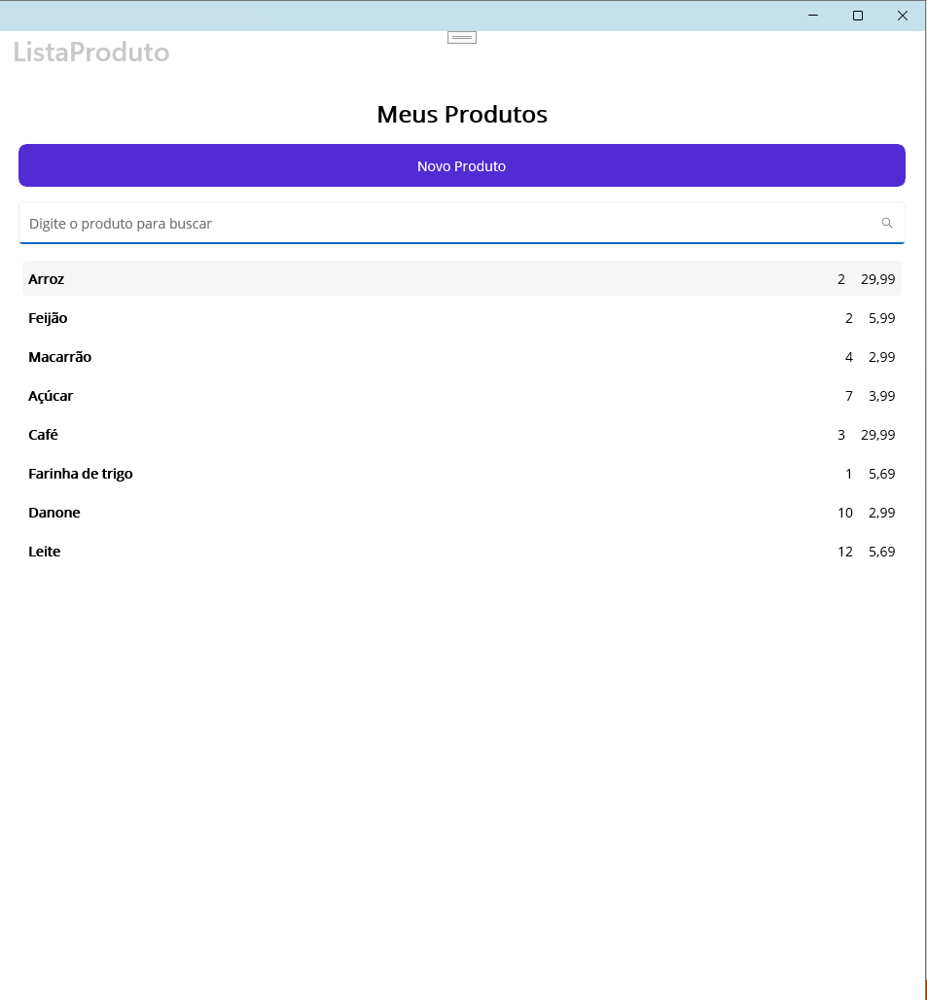
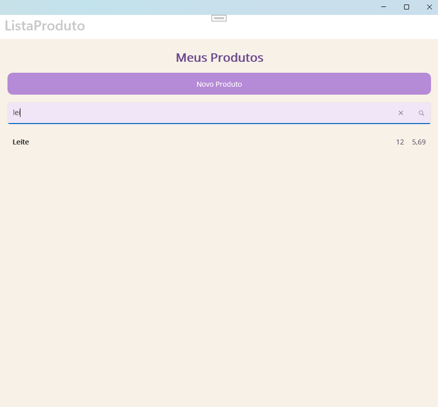

# MauiAppMinhasCompras

Aplicativo desenvolvido em .NET MAUI utilizando o Visual Studio e banco de dados SQLite.

O projeto está sendo desenvolvido ao longo das atividades da disciplina de Desenvolvimento de Sistemas III, do Módulo 3 do curso de Desenvolvimento de Sistemas, com o objetivo de colocar em prática os conteúdos estudados na disciplina.

## Funcionalidades

O aplicativo permite:
- Cadastrar novos produtos, informando descrição, quantidade e preço;
- Validar as informações preenchidas antes do cadastro;
- Armazenar os dados utilizando SQLite;
- Visualizar os produtos cadastrados em uma lista;
- Pesquisar produtos pelo nome utilizando busca dinâmica;
- Selecionar um produto já cadastrado;
- Editar as informações do produto;
- Salvar as alterações realizadas e atualizar a listagem;
- Manter os produtos armazenados mesmo após fechar e abrir novamente o aplicativo.

## Atualização do projeto

### Agenda 02

Na Agenda 02 foram desenvolvidas as principais funcionalidades do aplicativo.

Foi criada a tela de listagem dos produtos, a tela de cadastro de novos produtos e a tela de edição.

Também foi implementada a comunicação com o banco de dados SQLite, permitindo cadastrar, listar e atualizar os produtos.

Ao selecionar um item na tela de listagem, o aplicativo abre a tela Editar Produto, permitindo alterar a descrição, a quantidade e o preço. Após salvar, os dados são atualizados no banco SQLite e exibidos novamente na listagem.

### Agenda 03

Na Agenda 03 foi realizada uma atualização na forma como o aplicativo acessa o banco de dados SQLite.

No arquivo App.xaml.cs, foi criado um acesso centralizado ao banco utilizando o padrão Singleton. Dessa forma, o aplicativo reutiliza uma única instância da classe SQLiteDatabaseHelper durante sua execução.

O acesso ao banco passou a ser realizado por meio da propriedade:

App.Db

As telas também foram atualizadas para utilizar esse acesso centralizado:

NovoProduto.xaml.cs utiliza App.Db.Insert(produto) para cadastrar novos produtos;
ListaProduto.xaml.cs utiliza App.Db.GetAll() para carregar os produtos cadastrados;
EditarProduto.xaml.cs utiliza App.Db.Update(produto) para atualizar os produtos.

Com essa alteração, não é mais necessário criar uma nova instância da classe SQLiteDatabaseHelper em cada uma dessas telas.

### Agenda 04

Na Agenda 04 foi implementada a funcionalidade de busca dinâmica de produtos.

Foi adicionado um SearchBar na tela de listagem, permitindo pesquisar os produtos pelo nome. A busca acontece em tempo real por meio do evento TextChanged, ou seja, conforme o usuário digita, a lista é atualizada automaticamente mostrando apenas os produtos correspondentes à pesquisa.

Também foi utilizada uma ObservableCollection para armazenar os produtos e atualizar a interface de acordo com os resultados da busca.

Durante os testes, foi possível pesquisar parte do nome de um produto e visualizar somente os resultados correspondentes. Ao limpar o campo de pesquisa, todos os produtos voltam a ser exibidos.

Além da implementação da busca dinâmica, também foram realizadas alterações visuais na tela de listagem. Foram utilizados tons de bege e lilás no fundo, no título, no botão e no campo de pesquisa, deixando a interface mais agradável e personalizada.

## Tecnologias utilizadas

- .NET MAUI
- C#
- XAML
- SQLite
- Visual Studio
- Git
- GitHub

## Estrutura do projeto

O projeto possui uma tela para cadastrar novos produtos, informando descrição, quantidade e preço, uma tela para visualizar os produtos cadastrados e uma tela para editar as informações dos produtos já existentes.

Também foi utilizada a classe Produto para representar os dados dos produtos e a classe SQLiteDatabaseHelper para realizar as operações com o banco de dados SQLite.

O acesso ao banco de dados foi centralizado no arquivo App.xaml.cs, permitindo que as diferentes telas utilizem a mesma instância do banco durante a execução do aplicativo.

## Testes

Foram realizados testes para verificar o funcionamento das funcionalidades desenvolvidas.

Durante os testes foi possível:

- Cadastrar novos produtos;
- Visualizar os produtos cadastrados na tela de listagem;
- Pesquisar produtos pelo nome e visualizar a lista sendo filtrada em tempo real;
- Limpar o campo de pesquisa e visualizar novamente todos os produtos cadastrados;
- Validar campos obrigatórios antes do cadastro;
- Selecionar e editar um produto já cadastrado;
- Salvar as alterações e visualizar os novos dados na listagem;
- Fechar e abrir novamente o aplicativo, confirmando que os produtos permanecem armazenados no banco de dados SQLite;
- Compilar o projeto após as alterações realizadas sem apresentar erros.
  
## Imagens do projeto

### Aplicativo em funcionamento

#### Cadastro de produto

Tela utilizada para cadastrar um novo produto, informando descrição, quantidade e preço.

#### Edição de produto

Tela utilizada para alterar as informações de um produto já cadastrado.

#### Produto atualizado

Após a edição, o produto é atualizado e exibido novamente na tela de listagem.

#### Busca dinâmica de produtos

Tela de listagem com todos os produtos cadastrados, campo de pesquisa e a nova personalização da interface em tons de bege e lilás.

#### Pesquisa de produto

Ao digitar parte do nome do produto, a lista é atualizada em tempo real, exibindo apenas os resultados correspondentes.

## Autora

Bianca da Silva Fernandes Curcino
